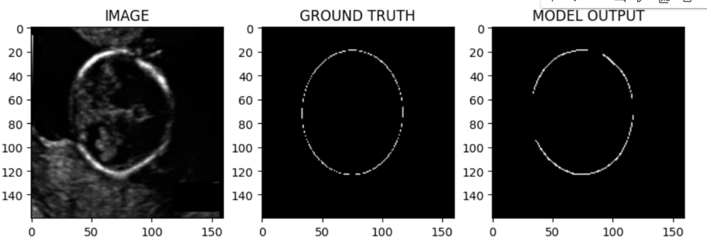

<h1>Fetal Brain Segmentation</h1>
Fetal brain segmentation is a critical task in medical image analysis, particularly in prenatal care and research. It involves the automatic delineation of different regions or structures within the fetal brain from medical imaging data, such as magnetic resonance imaging (MRI) or ultrasound images. The segmentation process aims to identify and label specific anatomical structures or tissues, including the cortex, ventricles, cerebellum, and other brain regions, with high precision and accuracy.

Accurate segmentation of the fetal brain is essential for various clinical and research purposes:

Prenatal Diagnosis and Monitoring: Segmenting fetal brain structures allows clinicians to assess fetal development, detect anomalies, and monitor the growth and health of the fetus during pregnancy. It enables early detection of abnormalities, such as ventriculomegaly (enlarged ventricles), agenesis of the corpus callosum, or other structural malformations.

Research and Development: Fetal brain segmentation plays a crucial role in advancing our understanding of prenatal brain development and associated disorders. Researchers utilize segmented images to study normal brain development trajectories, investigate the etiology of neurodevelopmental disorders, and develop new diagnostic and therapeutic approaches.

Treatment Planning: Accurate segmentation of fetal brain structures is essential for treatment planning in cases where fetal surgery or interventions are necessary. It provides valuable insights into the spatial relationships between different brain regions, guiding surgical procedures and minimizing risks.

Education and Training: Fetal brain segmentation also serves as a valuable educational tool for medical students, radiologists, and other healthcare professionals. It allows for the visualization and study of intricate fetal brain anatomy, facilitating training in prenatal imaging interpretation and diagnosis.

Segmenting fetal brain images is a challenging task due to factors such as low image resolution, fetal motion artifacts, varying gestational ages, and the complexity of brain structures. Advanced computational techniques, including deep learning-based approaches such as convolutional neural networks (CNNs), particularly architectures like UNet, have shown promise in accurately segmenting fetal brain structures from medical imaging data. These models leverage large annotated datasets to learn the complex patterns and variations present in fetal brain images, enabling automated and accurate segmentation.

Overall, fetal brain segmentation is a vital component of prenatal care and research, enabling clinicians and researchers to gain insights into fetal brain development, diagnose abnormalities, and improve patient outcomes through early intervention and treatment.

<h2>Key Packages Used</h2>
<ul>
  <li><b> CV2</b></li>
  <li><b> PyTorch</b></li>
  <li><b>NumPy</b> </li>
  <li><b>segmentation-models-pytorch</b> </li>
  <li> <b> Pandas</b></li>
  <li><b> Albumentations</b></li>
  <li><b>MatplotLib</b></li>
</ul>

<h2>Important Techniques</h2>
<ul>
  <li><b> Image Segmentation /Binary Segmentation </b></li>
  <li><b> Transfer Learning </b></li>
  <li><b> Data Augmentation</b></li>
  <li><b>Albumentations </b></li>
  </ul>
